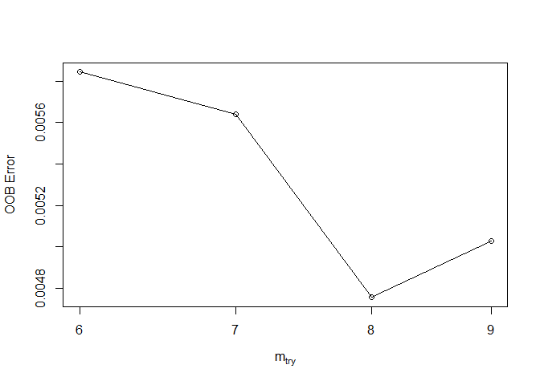
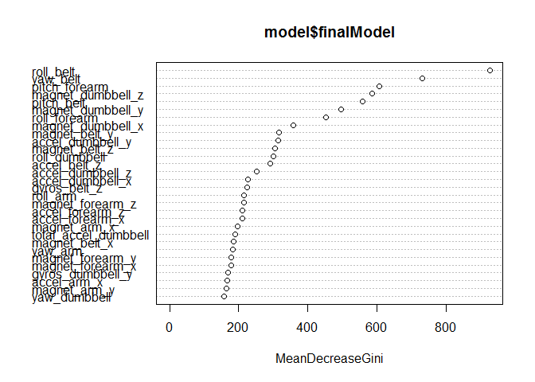

## Introduction and Summary

The goal of this project is to predict the manner in which test subjects (healthy young men) performed a simple weight lifting exercise (unilateral bicep curl). The data used for prediction[^1] consists of readings from a set of accelerometers attached to the subjects' dumbell, forearm, upper arm and belt. The variable to be predicted is the `classe` variable, which was assigned to one of five values:

* Class A indicates that the exercise was performed correctly, according to specifications.
* Classes B through E indicate that the exercise was performed incorrectly, and included one of four (pre-defined) mistakes, such as only lifting the dumbell half-way, or assuming an incorrect arm position.

The remainder of this report summarizes the data analysis and results.

## Loading and preprocessing the data

Initialize, load packages, and read in raw data:


```r
library(knitr)
library(caret)
```

```
## Loading required package: lattice
```

```
## Loading required package: ggplot2
```

```r
library(randomForest)
```

```
## randomForest 4.6-12
```

```
## Type rfNews() to see new features/changes/bug fixes.
```

```
## 
## Attaching package: 'randomForest'
```

```
## The following object is masked from 'package:ggplot2':
## 
##     margin
```

```r
library(ggplot2)
knitr::opts_chunk$set(echo = TRUE)
setwd("C:\\R\\Machine Learning Project")
```

```r
raw_data = read.table("pml-training.csv", 
                      header = TRUE, sep = ",", 
                      na.strings = c("NA", "#DIV/0!"))
```

On visual inspection of the training data file, it is clear that

* Several of the variables are not sensor-related data, but are row indexes, participant names, timestamps, etc.
* Many of the sensor-related variables are not direct measurements, but are statistical measures of *groups* of other observations (e.g. average, min/max, kurtosis). These variables are easy to identify because their values are almost always blank or NA, while the direct sensor measurements are populated for every observation.

The next step in the data processing is to remove all the variables that are not direct sensor measurements (but including the `classe` variable, currently at column 160).


```r
sensorVars = grep(pattern = "_dumbbell|_forearm|_arm|_belt",names(raw_data))
data = raw_data[, c(sensorVars,160)]

goodVars = !is.na(data)
omit = which(colSums(goodVars) < 1000)
data = data[, -omit]
dim(data)
```

```
## [1] 19622    53
```

This leaves 52 prediction variables, plus the `classe` variable. The final step is to split the data into a training subset and a testing subset.  


```r
set.seed(456)
inTrain = createDataPartition(y=data$classe, p = 0.75, list=F)
trainingData = data[inTrain,]
testingData = data[-inTrain,]
```

Since I'm going to use a nonparametric method (random forest), it is not necessary to do any normalization or transformation of the predictor variables.

Given the relatively large number of predictor variables, I considered using principal components analysis (PCA) to reduce the number of variables. However, this would make the model even more difficult to interpret, and would not be likely to produce much additional accuracy (the model is already very accurate, as shown below).

## Model Selection and Training

I chose to use the random forest algorithm (via the `caret` package), because it is generally very accurate. On the downside, random forest models are not at all easy to interpret or explain. They also tend to take a long time to run, especially on relatively large datasets such as the weight-lifting data (52 variables and almost 15,000 observations).

For general training parameters, I chose to use 5-fold repeated cross-validation (with 3 repeats). Cross validation improves the overall accuracy of the model at the expense of longer running time.

Specific to the random forest algorithm, I used the `tuneRF` function from the `randomForest` package to determine the best choice for the `mtry` parameter. The `mtry` parameter specifies the number of predictor variables randomly sampled at each split, and its optimal value depends on the data. As a general rule of thumb, `mtry` is close to the square root of the number of predictor variables.


```r
set.seed(257)
bestmtry <- tuneRF(trainingData[,1:52], trainingData$classe, 
                   stepFactor=1.2, improve=1e-6, ntree=100)
```

```
## mtry = 7  OOB error = 0.56% 
## Searching left ...
## mtry = 6 	OOB error = 0.58% 
## -0.03614458 1e-06 
## Searching right ...
## mtry = 8 	OOB error = 0.48% 
## 0.1566265 1e-06 
## mtry = 9 	OOB error = 0.5% 
## -0.05714286 1e-06
```

<!-- -->

According to the `tuneRF` results, the lowest out-of-bucket error was achieved when the `mtry` parameter was set to 8 (note that the default setting would have been 7). 

The other major parameter in the random forest algorithm is `ntree`, or the number of individual trees to grow. Typical choices for `ntree` can be 500 or more, and higher values generally produce more accurate models. In the present case, I started with `ntree` equal to 50 for model testing purposes (to reduce the run time of my program), and the resulting model was so accurate (well over 99%) that I chose not to use a higher value.


```r
control = trainControl(method="repeatedcv", number = 5, repeats = 3)
set.seed(2278)
mtry = 8
grid = expand.grid(.mtry = mtry)
model <- train(classe~., data=trainingData, trControl=control, method="rf",
               metric = "Accuracy", tuneGrid = grid, ntree=50)
# summarize results
print(model)
```

```
## Random Forest 
## 
## 14718 samples
##    52 predictor
##     5 classes: 'A', 'B', 'C', 'D', 'E' 
## 
## No pre-processing
## Resampling: Cross-Validated (5 fold, repeated 3 times) 
## Summary of sample sizes: 11774, 11775, 11773, 11775, 11775, 11773, ... 
## Resampling results:
## 
##   Accuracy   Kappa  
##   0.9932965  0.99152
## 
## Tuning parameter 'mtry' was held constant at a value of 8
```

```r
varImpPlot(model$finalModel)
```

<!-- -->

Even with a limited number of trees, the overall accuracy of the model with respect to the training data is very good. The plot above shows the overall importance of each variable in the trained model. 

### Model Testing

The model estimated in the previous section was applied to the testing dataset: 


```r
pred = predict(model, testingData)
confusionMatrix(pred, testingData$classe)
```

```
## Confusion Matrix and Statistics
## 
##           Reference
## Prediction    A    B    C    D    E
##          A 1395    4    0    0    0
##          B    0  942    6    0    0
##          C    0    3  848    5    2
##          D    0    0    1  798    1
##          E    0    0    0    1  898
## 
## Overall Statistics
##                                         
##                Accuracy : 0.9953        
##                  95% CI : (0.993, 0.997)
##     No Information Rate : 0.2845        
##     P-Value [Acc > NIR] : < 2.2e-16     
##                                         
##                   Kappa : 0.9941        
##  Mcnemar's Test P-Value : NA            
## 
## Statistics by Class:
## 
##                      Class: A Class: B Class: C Class: D Class: E
## Sensitivity            1.0000   0.9926   0.9918   0.9925   0.9967
## Specificity            0.9989   0.9985   0.9975   0.9995   0.9998
## Pos Pred Value         0.9971   0.9937   0.9883   0.9975   0.9989
## Neg Pred Value         1.0000   0.9982   0.9983   0.9985   0.9993
## Prevalence             0.2845   0.1935   0.1743   0.1639   0.1837
## Detection Rate         0.2845   0.1921   0.1729   0.1627   0.1831
## Detection Prevalence   0.2853   0.1933   0.1750   0.1631   0.1833
## Balanced Accuracy      0.9994   0.9956   0.9947   0.9960   0.9982
```

The results are impressive -- both sensitivity and specificity are over 99% for all 5 classes. Surprisingly, the model's accuracy on the testing data was slightly *higher* than the training data accuracy.

### Prediction for Test Cases

The same model was also applied to the 20-observation test dataset for the class quiz:


```r
test_case_data = read.table("pml-testing.csv", 
                      header = TRUE, sep = ",", 
                      na.strings = c("NA", "#DIV/0!"))
test_case_data = test_case_data[,names(trainingData)[1:52]]
predTestCases = predict(model, test_case_data)
print(predTestCases)
```

```
##  [1] B A B A A E D B A A B C B A E E A B B B
## Levels: A B C D E
```

Happily, all 20 predictions were correct.

### Footnotes

[^1]: Data is available at <http://web.archive.org/web/20161224072740/http:/groupware.les.inf.puc-rio.br/har>
